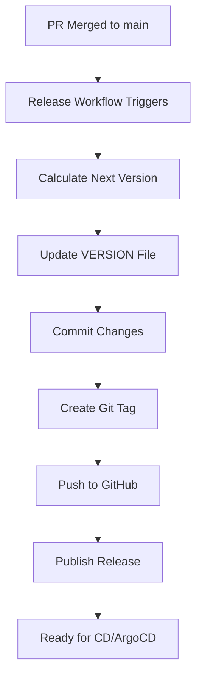

# CI/CD Setup Guide

## 📋 Overview

This CI setup implements professional GitHub Flow with semantic versioning. Here's what changed from your original setup:

### ✅ Issues Fixed

1. **Infinite Loop Prevention**: Added `[skip ci]` to version bump commits
2. **Atomic Versioning**: Tag creation happens AFTER version files are committed
3. **Race Condition Fix**: Release only triggers on PR merge, not every push
4. **Version Validation**: Checks if tag already exists before creating
5. **Proper Token Usage**: Uses `GITHUB_TOKEN` (built-in) instead of personal token
6. **Better Triggering**: Only runs on actual PR merge, not every PR event

---

## 🗂️ File Structure

```
.github/
├── workflows/
│   ├── ci.yml              # PR validation (tests, linting)
│   ├── release.yml         # Release creation on PR merge
│   └── pr-labeler.yml      # Auto-labels PRs based on branch name
└── release-drafter.yml     # Release notes configuration
```

---

## 🔄 Workflow Process

### 1. **Developer Creates Feature Branch**
```bash
git checkout -b feature/add-new-api
# or
git checkout -b fix/critical-bug
```

### 2. **Developer Opens PR**
- `pr-labeler.yml` automatically adds labels based on branch name
- `ci.yml` runs tests and validation
- CI checks that PR has a version label (major/minor/patch)

### 3. **PR Review & Merge**
- Team reviews PR
- Once approved, merge to `main`
- `release.yml` triggers automatically

### 4. **Automatic Release**
- Creates version tag based on labels
- Updates VERSION file (and package.json if exists)
- Commits version bump with `[skip ci]`
- Pushes tag
- Publishes GitHub release with changelog

---

## 🏷️ Labeling Strategy

### Automatic Labels (via branch name):
- `feature/*` or `feat/*` → `feature` + `minor`
- `fix/*` or `bugfix/*` → `bug` + `patch`
- `chore/*` → `chore` + `patch`
- `docs/*` → `documentation` + `patch`

### Manual Labels (if needed):
- `major` - Breaking changes (1.0.0 → 2.0.0)
- `minor` - New features (1.0.0 → 1.1.0)
- `patch` - Bug fixes (1.0.0 → 1.0.1)

---

## 📦 Version File Management

Currently supports:
- `VERSION` file (plain text)
- `package.json` (for Node.js projects)

### Adding More Version Files

Edit `.github/workflows/release.yml` in the "Update version files" step:

```yaml
- name: Update version files
  run: |
    VERSION="${{ steps.version.outputs.version }}"
    
    # Add your custom files here:
    
    # For Python setup.py
    sed -i "s/version='.*'/version='${VERSION}'/" setup.py
    
    # For Go version file
    echo "const Version = \"${VERSION}\"" > version.go
    
    # For Docker Compose
    sed -i "s/image: myapp:.*/image: myapp:${VERSION}/" docker-compose.yml
```

---

## 🚀 Setup Instructions

### 1. **Remove Old Files**
```bash
rm .github/workflows/release.yml
rm .github/workflows/move-release-branch.yml
rm .github/release-drafter.yaml  # Note: .yaml extension
```

### 2. **Add New Files**
Copy all 4 files from the artifacts to your repository:
- `.github/workflows/ci.yml`
- `.github/workflows/release.yml`
- `.github/workflows/pr-labeler.yml`
- `.github/release-drafter.yml`

### 3. **Create Labels** (if they don't exist)

Go to your GitHub repo → Settings → Labels and create:

```
major       - Breaking changes (red)
minor       - New features (blue)
patch       - Bug fixes/chores (green)
feature     - Feature (light blue)
bug         - Bug fix (red)
chore       - Maintenance (gray)
documentation - Docs (light purple)
```

Or use this script:
```bash
gh label create major --color "d73a4a" --description "Breaking changes"
gh label create minor --color "0075ca" --description "New features"
gh label create patch --color "0e8a16" --description "Bug fixes"
gh label create feature --color "a2eeef" --description "New feature"
gh label create bug --color "d73a4a" --description "Bug fix"
gh label create chore --color "fef2c0" --description "Maintenance"
gh label create documentation --color "0075ca" --description "Documentation"
```

### 4. **Initial Version Tag** (if starting fresh)

```bash
git tag v0.1.0
git push origin v0.1.0
```

### 5. **Configure Branch Protection** (Recommended)

Go to Settings → Branches → Add rule for `main`:

- ✅ Require status checks to pass before merging
  - Select: `CI Success`, `Test & Lint`, `Build`
- ✅ Require pull request reviews before merging
- ✅ Require conversation resolution before merging

---

## 🧪 Testing Your Setup

### Test 1: Create a Feature PR
```bash
git checkout -b feature/test-ci
echo "test" > test.txt
git add test.txt
git commit -m "feat: add test file"
git push origin feature/test-ci
```

Create PR → Check if:
- Auto-labeled with `feature` and `minor`
- CI runs successfully

### Test 2: Merge PR
- Merge the PR
- Check if:
  - New release created (e.g., v0.2.0)
  - VERSION file updated
  - Tag created
  - Release notes generated

---

## 🔧 Customization

### Add Tests to CI

Edit `.github/workflows/ci.yml`:

```yaml
- name: Run tests
  run: |
    npm test           # For Node.js
    # go test ./...    # For Go
    # pytest           # For Python
```

### Add Build Steps

```yaml
- name: Build application
  run: |
    npm run build
    # docker build -t myapp:${{ github.sha }} .
```

### Slack/Discord Notifications

Add to `.github/workflows/release.yml`:

```yaml
- name: Notify Slack
  if: steps.check_tag.outputs.exists == 'false'
  uses: slackapi/slack-github-action@v1
  with:
    payload: |
      {
        "text": "🚀 New release: ${{ steps.version.outputs.tag }}"
      }
  env:
    SLACK_WEBHOOK_URL: ${{ secrets.SLACK_WEBHOOK }}
```

---

## 🎯 Best Practices

1. **Branch Naming**: Use consistent prefixes
   - `feature/` for new features
   - `fix/` for bug fixes
   - `chore/` for maintenance

2. **Commit Messages**: Use conventional commits
   - `feat: add new feature`
   - `fix: resolve bug`
   - `chore: update dependencies`

3. **PR Size**: Keep PRs small and focused

4. **Version Labels**: Always ensure PRs have version labels before merging

5. **Testing**: Add comprehensive tests before merging

---

## 📊 What Happens After Merge?



---

## 🔮 Phase 2: CD Integration (Future)

When you're ready to add Helm charts and ArgoCD:

1. **Image Building**: Add Docker build to release workflow
2. **Helm Chart Update**: Update Chart.yaml with new version
3. **ArgoCD Sync**: Configure ArgoCD to watch for new tags
4. **Istio Traffic Routing**: Implement blue-green or canary deployments

---

## ❓ Troubleshooting

### Issue: Workflow not triggering
- Check if PR is actually merged (not just closed)
- Verify workflow files are in `.github/workflows/`
- Check GitHub Actions tab for errors

### Issue: Tag already exists
- Workflow skips release creation (by design)
- Delete existing tag if you need to recreate:
  ```bash
  git tag -d v1.0.0
  git push origin :refs/tags/v1.0.0
  ```
### How it will look in your README:

When rendered by GitHub, the code block above will display as this visualization:
## 📊 What Happens After Merge?


### Issue: Permission denied
- Ensure repository settings → Actions → General → Workflow permissions is set to "Read and write permissions"

---

| Branch Prefix | Auto Labels | Label Color | Version Bump | Example |
|--------------|-------------|-------------|--------------|---------|
| `feature/` or `feat/` | `feature` | `#a2eeef` | **minor** | v1.0.0 → v1.1.0 |
| `fix/` or `bugfix/` | `bug` | `#d73a4a` | **patch** | v1.0.0 → v1.0.1 |
| `chore/` | `chore` | `#fef2c0` | **patch** | v1.0.0 → v1.0.1 |
| `docs/` | `documentation` | `#0075ca` | **patch** | v1.0.0 → v1.0.1 |

### Manual Version Labels:
| Label | Color | Description | Version Bump | Example |
|-------|-------|-------------|--------------|---------|
| `major` | `#d73a4a` | Breaking changes | **major** | v1.0.0 → v2.0.0 |
| `minor` | `#0075ca` | New features | **minor** | v1.0.0 → v1.1.0 |
| `patch` | `#0e8a16` | Bug fixes | **patch** | v1.0.0 → v1.0.1 |
## 📚 Additional Resources

- [GitHub Flow](https://docs.github.com/en/get-started/quickstart/github-flow)
- [Semantic Versioning](https://semver.org/)
- [Conventional Commits](https://www.conventionalcommits.org/)
- [Release Drafter](https://github.com/release-drafter/release-drafter)

---

**Need help?** Open an issue or contact the DevOps team!
## 🏷️ Branch Labeling Strategy
## 🏷️ Labeling Strategy

### Automatic Labels (via branch name):
- `feature/*` or `feat/*` → `feature` + `minor`
- `fix/*` or `bugfix/*` → `bug` + `patch` 
- `chore/*` → `chore` + `patch`
- `docs/*` → `documentation` + `patch`

### Manual Version Labels:
- `major` - Breaking changes (1.0.0 → 2.0.0)
- `minor` - New features (1.0.0 → 1.1.0)
- `patch` - Bug fixes (1.0.0 → 1.0.1)

### Label Colors & Setup:
```bash
# Version labels
gh label create major --color "d73a4a" --description "Breaking changes"
gh label create minor --color "0075ca" --description "New features"
gh label create patch --color "0e8a16" --description "Bug fixes"

# Type labels
gh label create feature --color "a2eeef" --description "New feature"
gh label create bug --color "d73a4a" --description "Bug fix"
gh label create chore --color "fef2c0" --description "Maintenance"
gh label create documentation --color "0075ca" --description "Documentation"
## Visual Version with Color Badges:

```markdown
## 🏷️ Labeling Strategy

### Automatic Branch Labels:
| Branch Pattern | Auto-Labels | Version | Example |
|---------------|-------------|---------|---------|
| `feature/`, `feat/` | <span style="color:#a2eeef">■</span> `feature` | <span style="color:#0075ca">■</span> **minor** | v1.0.0 → v1.1.0 |
| `fix/`, `bugfix/` | <span style="color:#d73a4a">■</span> `bug` | <span style="color:#0e8a16">■</span> **patch** | v1.0.0 → v1.0.1 |
| `chore/` | <span style="color:#fef2c0">■</span> `chore` | <span style="color:#0e8a16">■</span> **patch** | v1.0.0 → v1.0.1 |
| `docs/` | <span style="color:#0075ca">■</span> `documentation` | <span style="color:#0e8a16">■</span> **patch** | v1.0.0 → v1.0.1 |

### Manual Version Overrides:
| Label | Color | Version | Example |
|-------|-------|---------|---------|
| <span style="color:#d73a4a">■</span> `major` | `#d73a4a` | **major** | v1.0.0 → v2.0.0 |
| <span style="color:#0075ca">■</span> `minor` | `#0075ca` | **minor** | v1.0.0 → v1.1.0 |
| <span style="color:#0e8a16">■</span> `patch` | `#0e8a16` | **patch** | v1.0.0 → v1.0.1 |