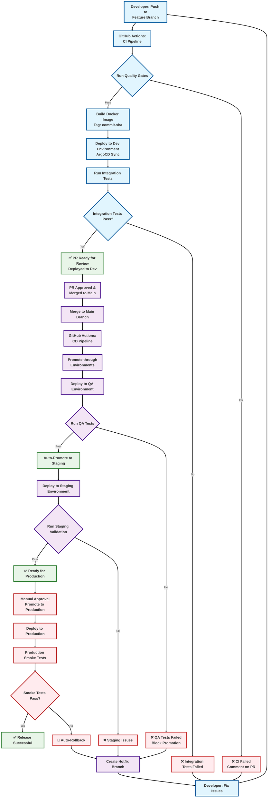

```mermaid
flowchart TD
    A[<b>Developer: Push to<br/>Feature Branch</b>] --> B[<b>GitHub Actions:<br/>CI Pipeline</b>]
    B --> C{<b>Run Quality Gates</b>}
    
    C -->|Pass| D[<b>Build Docker Image<br/>Tag: commit-sha</b>]
    C -->|Fail| E[<b>❌ CI Failed<br/>Comment on PR</b>]
    E --> F[<b>Developer: Fix Issues</b>]
    F --> A
    
    D --> G[<b>Deploy to Dev Environment<br/>ArgoCD Sync</b>]
    G --> H[<b>Run Integration Tests</b>]
    H --> I{<b>Integration Tests Pass?</b>}
    
    I -->|Yes| J[<b>✅ PR Ready for Review<br/>Deployed to Dev</b>]
    I -->|No| K[<b>❌ Integration Tests Failed</b>]
    K --> F
    
    J --> L[<b>PR Approved &<br/>Merged to Main</b>]
    
    L --> M[<b>Merge to Main Branch</b>]
    M --> N[<b>GitHub Actions:<br/>CD Pipeline</b>]
    N --> O[<b>Promote through<br/>Environments</b>]
    
    O --> P[<b>Deploy to QA Environment</b>]
    P --> Q{<b>Run QA Tests</b>}
    
    Q -->|Pass| R[<b>Auto-Promote to Staging</b>]
    Q -->|Fail| S[<b>❌ QA Tests Failed<br/>Block Promotion</b>]
    S --> T[<b>Create Hotfix Branch</b>]
    T --> F
    
    R --> U[<b>Deploy to Staging Environment</b>]
    U --> V{<b>Run Staging Validation</b>}
    
    V -->|Pass| W[<b>✅ Ready for Production</b>]
    V -->|Fail| X[<b>❌ Staging Issues</b>]
    X --> T
    
    W --> Y[<b>Manual Approval<br/>Promote to Production</b>]
    Y --> Z[<b>Deploy to Production</b>]
    Z --> AA[<b>Production Smoke Tests</b>]
    AA --> BB{<b>Smoke Tests Pass?</b>}
    
    BB -->|Yes| CC[<b>✅ Release Successful</b>]
    BB -->|No| DD[<b>🚨 Auto-Rollback</b>]
    DD --> T

    %% Style for larger text
    linkStyle default stroke:#000000,stroke-width:3px
    classDef default font-size:24px,font-weight:bold
    classDef feature fill:#e1f5fe,stroke:#01579b,stroke-width:4px,font-size:22px
    classDef main fill:#f3e5f5,stroke:#4a148c,stroke-width:4px,font-size:22px
    classDef production fill:#ffebee,stroke:#b71c1c,stroke-width:4px,font-size:22px
    classDef failure fill:#ffebee,stroke:#c62828,stroke-width:4px,font-size:22px
    classDef success fill:#e8f5e8,stroke:#2e7d32,stroke-width:4px,font-size:22px
    
    class A,B,C,D,E,F,G,H,I,J,K feature
    class L,M,N,O,P,Q,R,S,T,U,V,W,X main
    class Y,Z,AA,BB,CC,DD production
    class E,K,S,X,DD failure
    class J,R,W,CC success
```